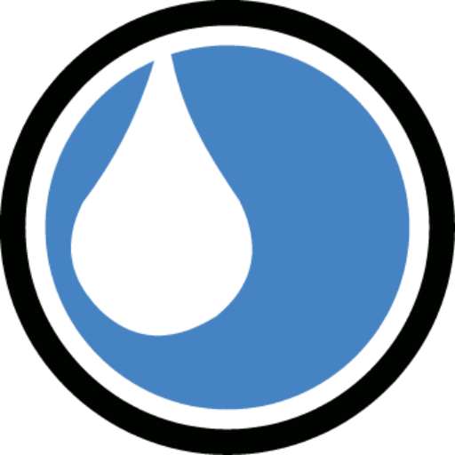

<p align="center">
    
</p>

<h1 align="center">Sistema de Control de Saneamiento - JAPAC</h1>

<p align="center">
    <strong>Plataforma Interna para la Junta de Agua Potable y Alcantarillado de Culiacán</strong>
</p>

---

## 💧 Acerca del Proyecto

Este sistema ha sido diseñado y desarrollado exclusivamente para el **Área de Saneamiento de JAPAC CLN**. Su objetivo principal es optimizar, automatizar y digitalizar el control operativo de las descargas de aguas residuales y el cumplimiento normativo de los establecimientos comerciales e industriales del municipio.

El sistema permite el seguimiento riguroso de los ciclos de inspección y el cálculo matemático automatizado de sanciones basándose en las leyes y muestreos correspondientes.

---

## 🛠️ Módulos Clave del Sistema

El proyecto está estructurado con una arquitectura robusta en **Laravel 11** y una interfaz moderna y ultra-minimalista basada en **AdminLTE 4 (Bootstrap 5)**:

- **📋 Control de Establecimientos (ABC):** Catálogo y padrón completo de giros comerciales, industriales y de servicios regulados por la junta.
- **🔍 Visitas de Inspección:** - *Inspecciones Formales:* Registro técnico detallado de actas de inspección en campo.
    - *Inspecciones Informales:* Reportes rápidos y visitas preventivas de seguimiento.
- **⚖️ Inicios de Procedimiento:** Control jurídico interno para el seguimiento de actas administrativas por incumplimiento.
- **🔬 Laboratorios Externos:** Carga y desglose analítico de parámetros fisicoquímicos (SST, DBO5, Grasas y Aceites, etc.) provenientes de muestreos de laboratorio externos.
- **🧮 Módulo de Cálculo Crítico:** Motor encargado del cálculo automatizado del **Índice de Incumplimiento** técnico de los establecimientos para la toma de decisiones.
- **✍️ Resolutivos Administrativos:** Generación y control de dictámenes, sanciones o liberaciones oficiales basadas en los resultados del cálculo.

---

## 🚀 Tecnologías Utilizadas

- **Backend:** PHP 8.2+ & Laravel 11 (Estructura ágil, enrutamiento seguro y ORM Eloquent).
- **Frontend:** AdminLTE 4 (Bootstrap 5 nativo, sin jQuery, interfaz responsiva y ligera).
- **Autenticación:** Laravel Breeze adaptado para credenciales personalizadas de usuario corporativo (`usuario` y `password` cifrado en Bcrypt).
- **Base de Datos:** MySQL / MariaDB.

---

## ⚙️ Configuración del Entorno de Desarrollo

Para levantar el proyecto de forma local, sigue estos pasos estructurados:

1. **Clonar el repositorio e instalar dependencias:**
   ```bash
   composer install
   npm install && npm run build
